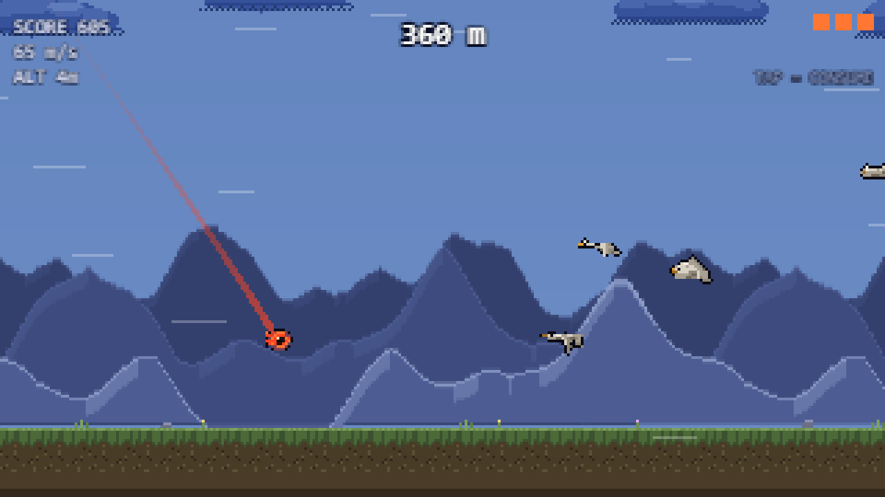

# Cloudship Longshot

**Launch your technique from the deck of a cloudship and watch it go.**

> _How far can your technique fly?_

A free, ad-free browser game — a 2D pixel-art launch-and-fly arcade run set in Will Wight's
**Cradle** universe.

---

## What it is

You are a sacred artist standing on the deck of a cloudship, high above the ground. You charge a
technique, aim it, and let it go. The camera follows the projectile out
across an endless side-scrolling world while the sky throws boosts, drags, hazards and outright
death at it. When the technique finally loses its momentum and settles, the run ends at whatever
distance it reached.

Distance is the entire fantasy. A run lasts somewhere between **30 seconds and 3 minutes**, a
restart takes under two seconds, and the loop is built around chasing your own personal record —
one more launch, a slightly better angle, a flock caught at the top of an arc.

Everything is local. No account, no server, no ads, nothing to buy.

## Screenshot

Captured from a production build with `npm run screenshot`, which takes the frame straight from the
renderer at the game's native 320x180 and enlarges it by a whole-number factor, so what you see is
exactly what the game draws.



## Controls

Play with a mouse, a touchscreen, or the keyboard alone. All three are first-class.

### Mouse / touch

| Action            | Input                                                                   |
| ----------------- | ----------------------------------------------------------------------- |
| Charge the launch | Press and **hold** anywhere on the play area                            |
| Aim               | **Drag vertically** while holding — up raises the angle, down lowers it |
| Launch            | **Release**                                                             |
| Use your ability  | **Tap** once mid-flight                                                 |

### Keyboard

| Action                        | Input                       |
| ----------------------------- | --------------------------- |
| Charge the launch             | Hold `Space` or `Enter`     |
| Aim                           | `Up` / `Down`, or `W` / `S` |
| Use your ability              | Tap `Space` mid-flight      |
| Pause                         | `Esc`                       |
| Retry from the results screen | `R`                         |

## Characters

Each character launches the same way and differs entirely in the single ability you spend
mid-flight. Abilities have limited charges per run, so _when_ you spend one matters as much as
which character you brought.

| Character  | Ability             | What it does                                                                                               |
| ---------- | ------------------- | ---------------------------------------------------------------------------------------------------------- |
| **Lindon** | `CONSUME`           | Locks into a straight line and accelerates like a rocket, shrugging off hazards while it burns.            |
| **Yerin**  | `SWORD SEEKER`      | Darts forward and strikes the first beast ahead, cutting through whatever is in the way.                   |
| **Mercy**  | `SHADOW STRINGS`    | Near-weightless glide with a gentle forward pull. The recovery tool when an arc goes wrong.                |
| **Ziel**   | `CONJURE FORMATION` | A rune pad flashes into being beneath the technique and slams it upward, harder than any ground formation. |
| **???**    | Locked              | A fifth character unlocks once you have flown **10 km in total with each** of the four above.             |

Per-character personal bests are tracked separately, so there is a record to chase on each one.

## What is in the sky

Objects are grouped into four families, and each family is readable by silhouette and iconography
as well as by colour.

| Family         | Objects                                                                                         | Effect                                                                                          |
| -------------- | ----------------------------------------------------------------------------------------------- | ----------------------------------------------------------------------------------------------- |
| **BOOST**      | Bird flocks, the rare golden beast, aura orbs, Thousand-Mile Clouds, ground rune-formation pads | Add speed, kick the trajectory upward, and pay out points                                       |
| **VITAL AURA** | Green _madra restored_, gold _aura shield_, cyan _light as air_                                 | Refund an ability charge, grant brief immunity, or cut gravity for a few seconds                |
| **SLOW**       | Storm clouds, armoured beasts                                                                   | Heavy drag inside a storm; armour shatters at speed and deflects you hard when you are too slow |
| **DEATH**      | Rock spike spires                                                                               | Landing on one ends the run immediately                                                         |

Hazards gate in by distance, so early metres are forgiving and the far country is not.

## Running it locally

### Prerequisites

- **Node.js 20 or newer** (22 recommended)
- **npm** (ships with Node)

No other tooling is required to build or play the game.

### Commands

| Command              | What it does                                                             |
| -------------------- | ------------------------------------------------------------------------ |
| `npm install`        | Install dependencies                                                     |
| `npm run dev`        | Start the Vite dev server with hot reload                                |
| `npm run build`      | Typecheck and produce the optimised production bundle in `dist/`         |
| `npm run preview`    | Serve the built `dist/` locally — the closest thing to the deployed site |
| `npm test`           | Run the unit test suite once                                             |
| `npm run test:watch` | Run the unit tests in watch mode                                         |
| `npm run test:e2e`   | Run the Playwright end-to-end suite against a production build           |
| `npm run lint`       | Lint the whole project, warnings treated as errors                       |
| `npm run format`     | Apply the Prettier formatting rules                                      |
| `npm run art`        | Regenerate the pixel art from the generator scripts in `tools/art`       |
| `npm run typecheck`  | Typecheck without building                                               |
| `npm run sim`        | Run the headless balance simulation and print telemetry                  |
| `npm run screenshot` | Capture `docs/screenshot.png` from a production build                    |

A quick start:

```bash
npm install
npm run dev
```

Then open the URL Vite prints (`http://localhost:5173` by default).

## Debug mode

Append `?debug=1` to the URL to enable the development overlay. It is off in every normal load and
none of it ships into a release build's hot path.

| Parameter | Effect |
| --- | --- |
| `?debug=1` | Enables debug mode and the frame-time / object-count readout |
| `&hitboxes=1` | Draws collision shapes, including the seeker's lock radius |
| `&fps=0` | Suppresses the readout while keeping the other flags |
| `&slow=1` | Quarter-speed simulation for inspecting a single interaction |
| `&charges=inf` | Ability charges never deplete |
| `&unlock=1` | Reveals the fifth character slot |
| `&seed=12345` | Fixes the world generator so a run reproduces exactly |
| `&spawn=rare` | Fills the world with one object kind — any of `bird`, `orb`, `storm`, `pad`, `spike`, `tmc`, `aura`, `armor`, `rare` |

For example, `?debug=1&hitboxes=1&spawn=armor&charges=inf` is the fastest way to check every
technique against armoured beasts.

## Project structure

The game is organised so that every tunable number lives in a data module and no gameplay value is
hard-coded in behaviour code.

```
cloudship-longshot/
├── src/
│   ├── data/       Tuning tables: physics, objects, spawning, scoring, characters, world, legal
│   ├── sim/        Deterministic simulation — physics, collisions, abilities, run lifecycle
│   ├── render/     Phaser rendering layers, parallax, particles, camera behaviour
│   ├── scenes/     Boot, Preload, Menu, CharacterSelect, Game, Results, Records, Settings, Credits
│   ├── ui/         HUD, menus, overlays, input mapping
│   ├── audio/      Web Audio mixing, sound and music playback
│   ├── core/       RNG, save/load, debug mode, shared utilities
│   └── assets/     Generated sprite sheets and audio consumed by the build
├── tools/
│   ├── art/        Procedural pixel-art generators
│   └── sim/        Headless balance-simulation harness
├── tests/
│   ├── unit/       Vitest suites
│   └── e2e/        Playwright flows
├── public/         Files copied verbatim into the build output
└── docs/           Deployment guide and release assets
```

This is the intended layout for the finished game. Directories fill in as the corresponding systems
land, so a working copy mid-development will not contain every folder listed above.

## Deployment

The site is a fully static build published to **GitHub Pages** by the workflow in
`.github/workflows/deploy.yml`. Every push to the default branch lints, tests, builds and deploys.

Full instructions — including how the Vite base path maps to the repository name, how to enable
Pages, and how to verify a deployment — are in **[docs/DEPLOYMENT.md](docs/DEPLOYMENT.md)**.

To check a production build locally before pushing:

```bash
npm run build
npm run preview
```

## Browser support

Current versions of **Chrome, Edge, Firefox and Safari** on desktop, and touch play on **iOS and
Android**. The game renders to a canvas at an internal 320×180 logical resolution and scales with
nearest-neighbour filtering, so it stays crisp from small laptops up to 4K, and it resizes correctly
mid-run.

## Accessibility

- **Keyboard-only play** — every screen, menu and gameplay action is reachable without a pointer.
- **Colourblind-safe object coding** — objects are distinguished by silhouette and icon, not colour
  alone, so the four families stay legible without relying on hue.
- **Reduced flash** — an option that removes screen flashes and lightning strobing.
- **Reduced effects** — an option that thins out particles and screen shake.
- **Independent volume sliders** for music and sound effects, including full mute.

Settings persist between sessions on the same browser.

## Attribution and legal

**Cradle and its characters are created by Will Wight and published by Hidden Gnome Publishing.
Used with permission.**

This is a fan project made with the express permission of the rights holders. It is **not** an
official commercial release.

- **Free forever.** No ads, no purchases, no monetization of any kind.
- **No tracking and no data collection.** Nothing about you is gathered, transmitted or sold.
- **Records, settings and unlocks are stored only in your own browser**, on your own device. There
  is no account and no server — clearing your browser storage clears your records.

All in-game artwork and audio are original work created for this project. Built on
[Phaser 3](https://phaser.io/).
